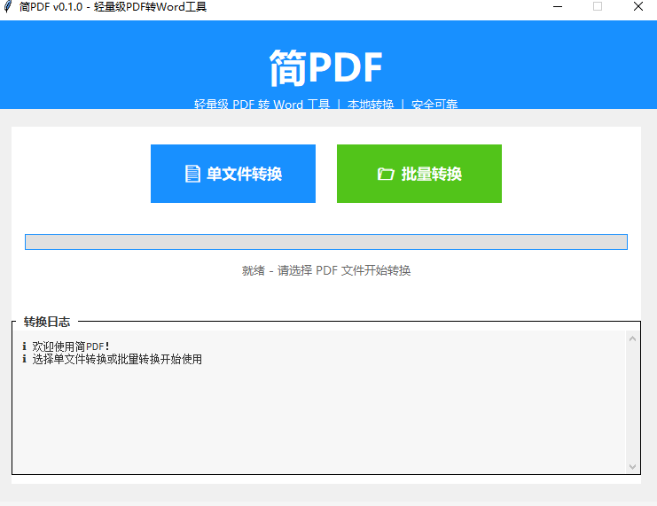

# 简PDF

[](https://github.com/misky530/jianpdf/releases)
[](LICENSE)

> 轻量级 PDF 转 Word 桌面工具 - 20MB 搞定一切！

## 🚀 快速开始

### 下载安装

**Windows 用户（推荐）:**

👉 **[下载最新版 v0.1.0](https://github.com/misky530/jianpdf/releases/latest)**

国内用户推荐使用 GitCode（速度更快）:

👉 **[GitCode 下载](https://gitcode.com/prometheus2025/jianpdf/releases)**

下载 `简PDF.exe`，双击运行即可！

### 从源码运行
```bash
git clone https://github.com/misky530/jianpdf.git
cd jianpdf
pip install -r requirements.txt
python src/main.py
```

## ✨ 功能特性

- ✅ **单文件转换** - 快速转换单个PDF
- ✅ **批量转换** - 同时处理多个PDF文件
- ✅ **本地转换** - 安全可靠，不上传服务器
- ✅ **实时进度** - 清晰的转换进度显示
- ✅ **轻量级** - 仅 25MB，比 Stirling-PDF 小 15 倍

## 📸 产品截图

### 主界面


*简洁直观的用户界面，一目了然*

### 单文件转换


*选择PDF文件，一键转换*

### 批量转换


*同时处理多个文件，实时显示进度*

### 转换完成


*详细的转换日志，成功失败一目了然*

## 🆚 与竞品对比

| 特性 | 简PDF | Stirling-PDF |
|------|-------|--------------|
| 安装包大小 | 25MB | 350MB |
| 安装方式 | 免安装 | 需要Docker |
| 启动速度 | 秒开 | 需要几分钟 |
| 使用难度 | 极简 | 复杂 |

## 📝 更新日志

查看 [Releases](https://github.com/misky530/jianpdf/releases) 了解版本历史

## 🤝 贡献

欢迎提交 Issue 和 Pull Request！

## 📄 开源协议

MIT License

## 📮 联系方式

- Issue: https://github.com/misky530/jianpdf/issues
- 微信: your_wechat
- 邮箱: your_email@example.com
```

---

### **Step 7: 通知第一个用户（5分钟）**
```
好消息！简PDF v0.1.0 正式发布了！🎉

下载地址:
👉 GitHub: https://github.com/misky530/jianpdf/releases/tag/v0.1.0
👉 GitCode: https://gitcode.com/prometheus2025/jianpdf/releases/tag/v0.1.0

(推荐使用 GitCode，国内速度快)

新版本功能:
✓ 单文件转换 - 快速转换单个PDF
✓ 批量转换 - 同时处理多个文件
✓ 实时进度 - 清晰显示转换进度
✓ 详细日志 - 记录每个文件的转换结果

使用说明:
1. 下载 简PDF.exe
2. 双击运行（无需安装）
3. 开始使用！

作为第一位用户，感谢您的支持和反馈！🙏

如有任何问题或建议，随时联系我！

Anthony